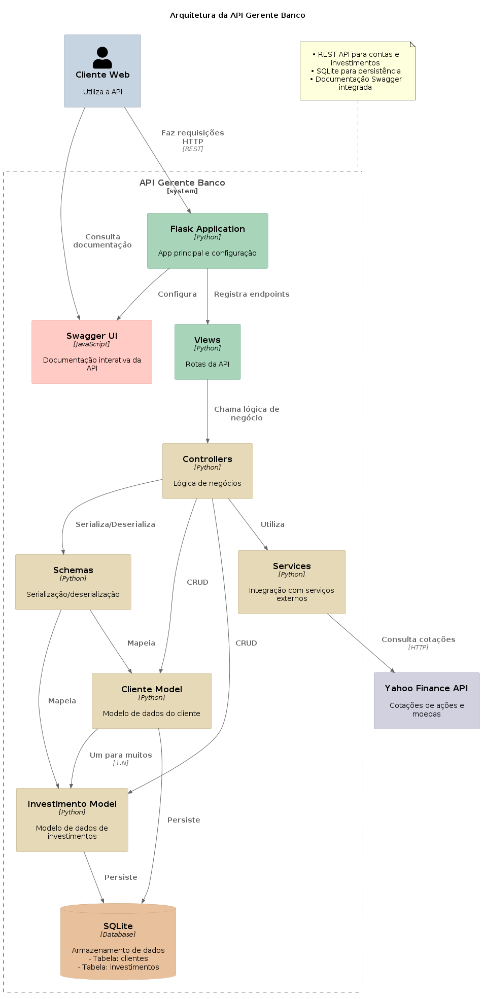

# 💼 API Gerente Banco MVP
---


Este é um MVP (Minimum Viable Product) para um sistema de gerenciamento de clientes de banco e seus investimentos. O sistema permite que os gerentes de banco possam listar, pesquisar, editar e remover clientes, visualizar produtos bancários e níveis de conta (bronze, prata, ouro, diamante), além de gerenciar investimentos em ações e moedas estrangeiras (dólar).

---

## 🌟 Funcionalidades

- **Gerenciamento de Clientes** - CRUD completo
- **Níveis de Conta** - Bronze, Prata, Ouro, Diamante
- **Investimentos**:
  - Compra de ações da B3 (automaticamente adiciona sufixo .SA)
  - Compra de dólares com cotação atualizada
  - Visualização agregada de portfólio
  - Cálculo automático do valor atual da carteira
- **API Documentada** - Swagger UI integrado

---

## 🛠️ Tecnologias Utilizadas

- **Python 3** 🐍
- **Flask** 🌐
- **SQLite** 🗃️
- **Flask-SQLAlchemy** 📦
- **Flask-Marshmallow** 🌾
- **Swagger UI** 📜
- **YFinance** 📈
- **Docker** 🐋

---

## 🗂️ Estrutura do Projeto

```plaintext
├── app.py                  # Aplicação principal Flask
├── config.py               # Configurações do projeto
├── Dockerfile              # Instruções para construção da imagem Docker
├── docker-compose.yml      # Configuração do ambiente Docker
├── .dockerignore           # Arquivos ignorados pelo Docker
├── controllers/            # Lógica de negócios
│   ├── cliente_controller.py
│   └── investimento_controller.py
├── instance/               # Banco de dados SQLite
├── models/                 # Modelos de dados
│   ├── cliente.py
│   └── investimento.py
├── schemas/                # Schemas para serialização/deserialização
│   ├── cliente_schema.py
│   └── investimento_schema.py
├── services/               # Serviços externos
│   └── finance_service.py  # Integração com Yahoo Finance
├── static/
│   └── swagger.json        # Especificação da API
├── views/                  # Rotas da API
│   ├── cliente_view.py
│   └── investimento_view.py
├── README.md
└── requirements.txt
```

---

## ⚙️ Configuração do Ambiente

1. **Clone o repositório:**

   ```bash
   git clone https://github.com/kevincoe/api-gerente-banco-mvp.git
   cd api-gerente-banco-mvp
   ```

2. **Crie e ative o ambiente virtual:**

   ```bash
   python3 -m venv backend-api
   source backend-api/bin/activate
   ```

3. **Construa e inicie os contêineres:**
  **Para iniciar os contêineres**
   ```bash
   docker-compose up --build -d
   ```
   **Para encerrar os contêineres:**
   ```bash
   docker-compose down
   ```
      **Para rodar os contêineres:**
   ```bash
   docker run backend-avancado-api_api
   ```

---

## 🚀 Acessando a Aplicação

1. **Em seu navegador:**

   ```bash
   API: http://localhost:5000/api
   Documentação Swagger: http://localhost:5000/swagger
   ```

---
## 📡 Endpoints da API

### 🧑‍💼 Clientes

- **Listar todos os clientes:**

  ```http
  GET /api/clientes
  ```

- **Obter um cliente pelo ID:**

  ```http
  GET /api/clientes/{id}
  ```

- **Criar um novo cliente:**

  ```http
  POST /api/clientes
  Body:
  {
      "nome": "string",
      "agencia": "string",
      "conta": "string",
      "nivel": "string",
      "produtos": "string"
      "saldo": 0.0
  }
  ```

- **Atualizar um cliente:**

  ```http
  PATCH /api/clientes/{id}
  Body:
  {
      "nome": "string",
      "agencia": "string",
      "conta": "string",
      "nivel": "string",
      "produtos": "string",
      "saldo": 0.0
  }
  ```

- **Remover um cliente pelo ID:**

  ```http
  DELETE /api/clientes/{id}
  ```

### Investimentos 📈💰

- **Listar Investimentos de um cliente:**
  ```http
  GET /api/clientes/{cliente_id}/investimentos
  ```

- **Listar Investimentos agregados:**
  ```http
  GET /api/clientes/{cliente_id}/investimentos/agregados
  ```

- **Obter valor atual da carteira:**
  ```http
  GET /api/clientes/{cliente_id}/investimentos/carteira
  ```

- **Comprar ações:**
  ```http
  POST /api/clientes/{cliente_id}/investimentos/acoes
  Body:
  {
      "simbolo": "PETR4",
      "quantidade": 10
  }
  ```

- **Comprar dólares:**
  ```http
  POST /api/clientes/{cliente_id}/investimentos/dolar
  Body:
  {
      "quantidade": 100
  }
  ```
---

## Modelos de Dados📊🗃️

### Cliente

| Campo     | Tipo         | Descrição                                         |
|-----------|--------------|---------------------------------------------------|
| id        | Integer      | Identificador único                               |
| nome      | String(100)  | Nome do cliente                                   |
| agencia   | String(10)   | Número da agência                                 |
| conta     | String(20)   | Número da conta                                   |
| saldo     | Numeric(10,2)| Saldo em reais                                    |
| nivel     | String(20)   | Nível (Bronze, Prata, Ouro, Diamante)             |
| produtos  | String(200)  | Produtos contratados (separados por vírgula)      |

### Investimento

| Campo        | Tipo         | Descrição                                  |
|--------------|--------------|--------------------------------------------|
| id           | Integer      | Identificador único                        |
| cliente_id   | Integer      | ID do cliente (chave estrangeira)          |
| tipo         | String(20)   | Tipo: "acao" ou "moeda"                    |
| simbolo      | String(20)   | Código da ação ou moeda (ex: PETR4)        |
| quantidade   | Float        | Quantidade de ações/moedas                 |
| preco_compra | Float        | Preço unitário na compra                   |
| data_compra  | DateTime     | Data e hora da compra                      |

---
## Fluxograma da Arquitetura da API:
---
